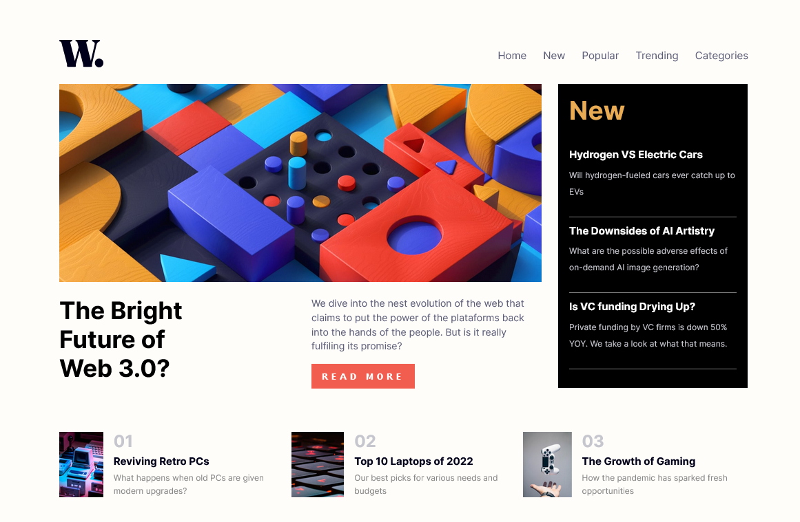

# Frontend Mentor - News homepage solution

This is a solution to the [News homepage challenge on Frontend Mentor](https://www.frontendmentor.io/challenges/news-homepage-H6SWTa1MFl). Frontend Mentor challenges help you improve your coding skills by building realistic projects.

### The challenge

Users should be able to:

- View the optimal layout for the interface depending on their device's screen size
- See hover and focus states for all interactive elements on the page

### Screenshot

### Links

- Solution URL: https://github.com/RoqueZ12/Newsletter-sign-up-form-
- Live Site URL: https://roquez12.github.io/Newsletter-sign-up-form-/

## My process

### Built with

- Semantic HTML5 markup
- CSS custom properties
- CSS Grid
- [React](https://reactjs.org/) - JS library
- [Next.js](https://nextjs.org/) - React framework
- [Styled Components](https://styled-components.com/) - For styles

## Author

- GitHub - [RoqueZ12](https://github.com/RoqueZ12/RoqueZ12)
- Frontend Mentor - [RoqueZ12](https://www.frontendmentor.io/profile/RoqueZ12)
